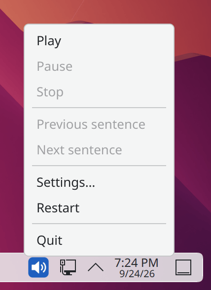
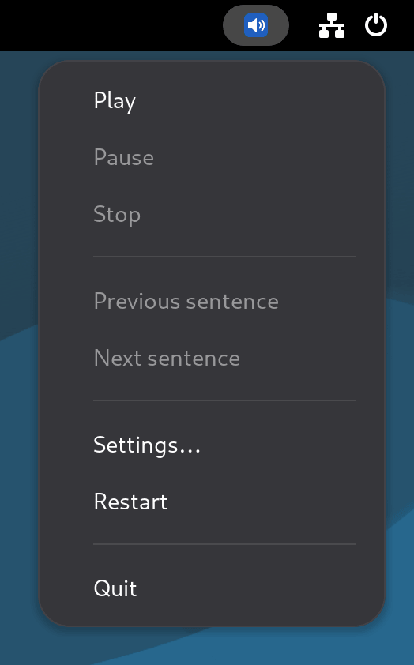
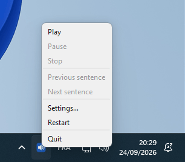

# PiperRead

<p align="center">
  
  
  
  
  
</p>

**English** | [Français](docs/fr-FR/README.md) | [Deutsch](docs/de-DE/README.md) | [Español](docs/es-ES/README.md)

## Description

**PiperRead** is a lightweight automation solution designed to bring high-quality neural text-to-speech (TTS) to Linux desktops.

**Official Website**: [piperread.davalan.fr](https://piperread.davalan.fr)

Unlike cloud-based solutions, PiperRead operates entirely offline (locally) thanks to the [Piper](https://github.com/OHF-voice/piper1-gpl) engine. It acts as a bridge between your desktop environment (Clipboard/Mouse) and the synthesis engine.

It allows you to read aloud any text selected with the mouse or copied to the clipboard, without requiring a complex screen reader.

## Two ways to read

The two are independent: neither drives the other, and either works without the other.

*   **The launcher** (`piperread`, or `read.sh` from a clone): a button or a keyboard shortcut reads the selection. Nothing runs between two readings; the voice is loaded again at each click, so the first sound comes about 1.3 seconds later.
*   **The interface** (`piperread-gui`, optional): a resident tray icon that starts with your session and keeps the voice loaded. Reading starts within 168 milliseconds of the click, and it adds pause, resume and sentence-by-sentence navigation. It also runs on Windows.

Started together, both read at the same time (two voices overlapping): pick one gesture.

The interface is an icon in the notification area; a right click on it opens its menu.

<p align="center">
  
  &nbsp;&nbsp;&nbsp;
  
  &nbsp;&nbsp;&nbsp;
  
</p>
<p align="center"><sub>KDE Plasma, GNOME (with the AppIndicator extension) and Windows 11</sub></p>

## Use Cases

*   **Accessibility**: Quick reading of content for people with mild visual impairment or eye fatigue.
*   **Productivity**: Listening to articles or documents while performing another task.
*   **Proofreading**: Hearing your own text read by a third-party voice to detect errors.

## Key Features

*   **Total Privacy**: 100% local processing. No data is sent to any cloud.
*   **Zero Latency**: no network round trip, and measured: about 1.3 seconds from the launcher to the first sound, 168 milliseconds from a click to the first sound with the resident interface (measurements below).
*   **Universal Compatibility**: Automatically detects and adapts to **Wayland** (Debian 12/13) or **X11**.
*   **Smart Selection**: Prioritizes mouse selection (primary) and switches to clipboard if no selection is active.
*   **Isolation**: Runs in its own Python virtual environment to avoid polluting your system.

---

## Installation from a package

The simplest way. Download the package for your system from the [download page](https://piperread.davalan.fr/download/) or from the [latest release](https://github.com/RonanDavalan/PiperRead/releases/latest), then install it:

```bash
# Debian 12 and 13, Ubuntu 22.04 and 24.04, Linux Mint
sudo apt install ./piperread_0.3.2~alpha_all.deb

# Fedora 42
sudo dnf install ./piperread-0.3.2~alpha-1.fc42.noarch.rpm

# openSUSE Leap 15.6
sudo zypper install ./piperread-0.3.2~alpha-1.leap156.noarch.rpm

# Arch Linux
sudo pacman -U piperread-0.3.2alpha-1-any.pkg.tar.zst
```

The package installs the Piper engine with `pip` when it is configured: about 75 MB to download (200 to 250 MB once installed), with network access needed at that moment only. It ships no voice. Download one, then check the installation:

```bash
piperread --download-voice
piperread --diagnose
```

The packages were validated in containers (installation, diagnostic and removal) on each distribution and version listed above. The manual is available as a page (`man piperread`) and as a PDF in four languages on the download page.

### The interface (optional)

`piperread-gui` is a separate package that depends on `piperread`: install the core first (or both in one command, for example `sudo apt install ./piperread_0.3.2~alpha_all.deb ./piperread-gui_0.3.2~alpha_all.deb`).

```bash
# Debian 12 and 13, Ubuntu 22.04 and 24.04, Linux Mint
sudo apt install ./piperread-gui_0.3.2~alpha_all.deb

# Fedora 42
sudo dnf install ./piperread-gui-0.3.2~alpha-1.fc42.noarch.rpm

# openSUSE Leap 15.6
sudo zypper install ./piperread-gui-0.3.2~alpha-1.leap156.noarch.rpm

# Arch Linux
sudo pacman -U piperread-gui-0.3.2alpha-1-any.pkg.tar.zst
```

The interface uses Qt (PySide6), which distributions do not package: the installation fetches it with `pip` into a private virtual environment, about 245 MB to download (650 to 700 MB once installed), with network access needed at that moment only. The same packages were validated in containers on the same distributions.

### Windows (interface only)

The launcher is a Linux tool; on Windows, only the interface is available, as a self-contained folder. Download `piperread-gui-windows.zip` from the [latest release](https://github.com/RonanDavalan/PiperRead/releases/latest) and unzip it anywhere, keeping the folder whole. Put a voice in its `voices` folder (two files with the same name, `<name>.onnx` and `<name>.onnx.json`, from [rhasspy/piper-voices](https://huggingface.co/rhasspy/piper-voices)), then double-click `piperread-gui.exe`. The build is not signed with a certificate Windows recognises: SmartScreen may warn on the first launch (choose "More info", then "Run anyway"). It reads the clipboard only, not the mouse selection. It was tried by hand on Windows 11; there is no automated test matrix for Windows as there is for the Linux packages.

## Prerequisites

Before installing from the sources, ensure your system has the required audio and clipboard tools.

```bash
# System update
sudo apt update

# Install Python, Audio, and Clipboard tools
# (Installs both wl-clipboard for Wayland and xsel for X11 to ensure compatibility)
sudo apt install -y python3 python3-venv python3-pip alsa-utils wl-clipboard xsel libnotify-bin
```

---

## Installation from the sources

Since this project relies on large voice models and a specific virtual environment, you must initialize the project after cloning it.

### 1. Clone the repository

```bash
mkdir -p $HOME/git/piper
cd $HOME/git/piper
git clone https://github.com/RonanDavalan/PiperRead.git
cd PiperRead
```

### 2. Initialize the environment (Critical)

This step creates the Python isolation, installs the engine, then downloads the voice you choose. `./read.sh --list-voices` lists the proposed voices with their licence, size and listening links; the voice quality is a matter of personal taste.

```bash
# Create virtual environment
python3 -m venv piper-env

# Install Piper TTS Engine
./piper-env/bin/pip install piper-tts

# Download a voice (see the choices with ./read.sh --list-voices)
./read.sh --download-voice en_US-ljspeech-medium
```

### 3. Configure permissions

```bash
chmod 700 read.sh
```

### 4. Desktop Integration (Icon and Menu)

To launch PiperRead like a native application:

```bash
# Create local applications and icons folders
mkdir -p $HOME/.local/share/applications $HOME/.local/share/icons/hicolor/scalable/apps

# Install the icon
cp Ressources/piperread.svg $HOME/.local/share/icons/hicolor/scalable/apps/

# Generate the desktop file with the actual installation path
sed "s|\$HOME/git/piper/PiperRead|$(pwd)|g" Ressources/PiperRead.desktop > $HOME/.local/share/applications/piperread.desktop

# Update menu database
update-desktop-database $HOME/.local/share/applications
```

### 5. The interface (optional)

The tray interface lives in the `gui/` folder of the repository and runs from a clone too, with its own Python environment: see [gui/README.md](gui/README.md). Once that environment is set up, start the interface with `gui/.venv/bin/python3 -m piperread_gui.app`; with the `piperread-gui` package installed, the command is `piperread-gui`.

---

## Usage

### Method 1: Mouse Selection (Recommended)

1.  **Highlight text** in any application (Browser, PDF, Editor).
2.  Click the **PiperRead** icon in your menu (or use your custom keyboard shortcut).
3.  The text is read immediately.

### Method 2: Clipboard

1.  Copy text (**Ctrl+C**).
2.  Launch PiperRead.

### Stopping Playback

Run `piperread --stop` (or `./read.sh --stop` from a clone) to end the reading, `--pause` to suspend it and `--resume` to continue where it stopped. Bind these commands to keyboard shortcuts if you like.

### The resident interface

The `piperread-gui` package starts with your session (a Linux desktop reads its autostart entry; on Windows, PiperRead adds itself to the startup programs at the first launch). A tray icon appears; the voice loads in the background and stays loaded, and while a sentence plays the next one is already being synthesized.

*   **Left click** on the icon: read when stopped, pause while reading, resume when paused.
*   **Right click**: the menu (Play, Pause, Stop, Previous sentence, Next sentence, Settings, Restart, Quit), in the language of your configuration.
*   **What is read**: the mouse selection, or the clipboard when nothing is selected (Linux, the same order as the launcher); the clipboard only on Windows. Markdown markup is removed first.
*   **Settings**: the menu entry opens a dialog for the voice, the speed, the language and "Start with the session" (on by default; untick it to stop the automatic start). It writes the same `piperread.conf` as the launcher.

The interface is also driven from the command line, which is how you bind it to keyboard shortcuts:

```bash
piperread-gui --play      # read; starts the interface first if it is not running
piperread-gui --pause
piperread-gui --resume
piperread-gui --stop
piperread-gui --next
piperread-gui --previous
piperread-gui --quit
```

Except `--play`, these commands report an error when no interface is running. On desktops that show a tray natively (KDE Plasma, XFCE, Cinnamon, MATE, LXQt) the icon simply appears. GNOME shows no tray by default: PiperRead says so once in a notification and stays fully usable through the commands above; to get the icon, install the "AppIndicator and KStatusNotifierItem Support" extension.

### Measured latency

"Zero latency" means there is no network round trip between the selection and the first sound: everything runs on your machine. The duration itself was measured on 23 September 2026, on the maintainer's machine (32 cores) with the `fr_FR-siwis-medium` voice. It varies with the machine and the voice; treat it as an order of magnitude, not a guarantee.

| Path | Measured |
|---|---|
| Launcher (`read.sh auto`), voice loaded at each click | 1.31 to 1.34 s from the launch to the first audio byte |
| Interface, voice already loaded | 168 ms from the click to the opening of the audio stream |

At rest the interface uses no CPU; its memory is about 100 MB, plus 150 MB (voice loaded) to 370 MB (after use) for the synthesis server it starts, which listens on `127.0.0.1` only.

### Configuration

Four settings can be adjusted: reading `speed` (a multiplier from 0.5 to 3.0, 1 is the natural voice), `voice` (the model name, as listed by `--list-voices`), `lang` (the message language: `en`, `fr`, `de` or `es`) and `telemetry` (`on` or `off`, see below). Each one is resolved in this order — the first level that provides a valid value wins:

1.  **Command-line option** — `--speed 1.25`, `--voice en_US-ljspeech-medium`, `--lang en` (`telemetry` has no option).
2.  **Environment variable** — `PIPERREAD_SPEED`, `PIPERREAD_VOICE`, `PIPERREAD_LANG`, `PIPERREAD_TELEMETRY`.
3.  **Configuration file** — `~/.config/piperread/piperread.conf` (on Windows, `%USERPROFILE%\.config\piperread\piperread.conf`), one `key=value` line per setting:
    ```
    speed=1.25
    voice=en_US-ljspeech-medium
    lang=en
    telemetry=off
    ```
4.  **Default** — natural speed, the first installed voice in alphabetical order, English messages, telemetry off.

An invalid value at any level below the option is ignored and the next level is tried instead; an invalid command-line option stops the reading.

### Engine telemetry

The inference library that Piper pulls in (`onnxruntime`) sends usage events to Microsoft by default. PiperRead turns them off before starting the engine, so that reading stays offline: `strace` shows no external connection while reading, with the launcher and with the interface. On Windows, the library writes its events to the system, which may forward them according to your privacy settings; PiperRead calls the library's own switch, and a measurement showed 4 initialisation events remaining against 15 without it. `telemetry=on` (or `PIPERREAD_TELEMETRY=on`) turns them back on.

---

## Quality

This project was born from a discovery: the impressive quality of the **Piper** engine for a fully free and local solution.

*   **Natural Vocal Rendering**: The choice of this neural technology allows for fluid and poised reading, making listening comfortable over time.
*   **Lightweight Architecture**: PiperRead is not a heavy application, but a minimalist orchestrator. It connects your desktop and the audio engine with an almost non-existent system footprint.
*   **Clean Installation**: The strict use of virtual environments (venv) ensures that the software remains confined and does not modify your main system libraries.

---

## Project Origin

The impetus for this project comes from my brother, a historic Debian user, who identified Piper as a useful solution for local TTS.

---

## Credits & "Vibe Coding"

The **PiperRead** project is the result of a hybrid **Human-AI** collaboration:

*   **Ronan Davalan**: Architect & Arbiter. Product vision, security requirements, project direction, validation and testing. All architectural decisions are validated by him.
*   **Claude Code (Anthropic)**: Systems Engineer & Lead Developer. Implementation of the Bash scripts, the documentation and the website; technical choices within the validated architecture. Principal author of the source code.
*   **Google Gemini**: Synthesizer & Strategic Advisor. Independent architectural analysis, logical conflict resolution, workflow optimisation, cross-validation of technical decisions.
*   **Muse Spark**: Synthesizer & Strategic Advisor. Replaces Gemini in some sessions, with good results; some of its answers were passed on to Claude Code.
*   **DeepSeek**: Cleanup of the project's working framework at the start of the project.
*   **Core Engine**: [Piper TTS](https://github.com/OHF-voice/piper1-gpl), licensed GPL-3.0-or-later. It is installed on your machine by `pip` and called as an external program; PiperRead does not redistribute it.
