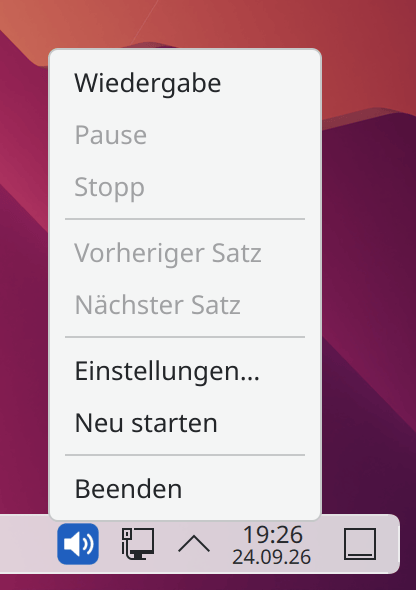
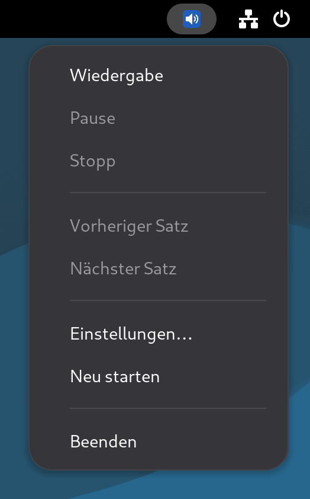
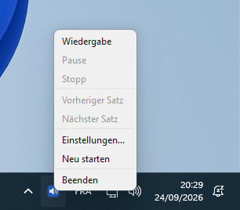

# PiperRead

<p align="center">
  
  
  
  
  
</p>

[English](../../README.md) | [Français](../fr-FR/README.md) | **Deutsch** | [Español](../es-ES/README.md)

## Beschreibung

**PiperRead** ist eine leichtgewichtige Automatisierungslösung, die entwickelt wurde, um hochwertige neuronale Sprachsynthese (TTS) auf Linux-Desktops zu bringen.

**Offizielle Website**: [piperread.davalan.fr](https://piperread.davalan.fr)

Im Gegensatz zu Cloud-Lösungen arbeitet PiperRead dank der [Piper](https://github.com/OHF-voice/piper1-gpl)-Engine vollständig offline (lokal). Es fungiert als Brücke zwischen Ihrer Desktop-Umgebung (Zwischenablage/Maus) und der Synthese-Engine.

Es ermöglicht das Vorlesen jedes mit der Maus ausgewählten oder in die Zwischenablage kopierten Textes, ohne dass ein komplexer Screenreader erforderlich ist.

## Zwei Arten zu lesen

Beide sind unabhängig: keines steuert das andere, und jedes funktioniert auch ohne das andere.

*   **Der Launcher** (`piperread`, oder `read.sh` aus einem Klon): eine Schaltfläche oder eine Tastenkombination liest die Auswahl vor. Zwischen zwei Vorlesevorgängen läuft nichts; die Stimme wird bei jedem Klick erneut geladen, sodass der erste Ton etwa 1,3 Sekunden später ertönt.
*   **Die Oberfläche** (`piperread-gui`, optional): ein residentes Tray-Symbol, das mit Ihrer Sitzung startet und die Stimme geladen hält. Das Vorlesen beginnt innerhalb von 168 Millisekunden nach dem Klick, und es fügt Pause, Fortsetzen und satzweise Navigation hinzu. Sie läuft auch unter Windows.

Zusammen gestartet, lesen beide gleichzeitig vor (zwei sich überlappende Stimmen): Wählen Sie eine Geste.

Die Oberfläche ist ein Tray-Symbol im Benachrichtigungsbereich; ein Rechtsklick darauf öffnet ihr Menü.

<p align="center">
  
  &nbsp;&nbsp;&nbsp;
  
  &nbsp;&nbsp;&nbsp;
  
</p>
<p align="center"><sub>KDE Plasma, GNOME (mit der Erweiterung AppIndicator) und Windows 11</sub></p>

## Anwendungsfälle

*   **Barrierefreiheit**: Schnelles Vorlesen von Inhalten für Menschen mit leichter Sehbehinderung oder Augenermüdung.
*   **Produktivität**: Anhören von Artikeln oder Dokumenten während der Erledigung einer anderen Aufgabe.
*   **Korrektur**: Vorlesen eigener Texte durch eine fremde Stimme, um Fehler zu erkennen.

## Hauptfunktionen

*   **Vollständige Privatsphäre**: 100% lokale Verarbeitung. Keine Daten werden an eine Cloud gesendet.
*   **Null Latenz**: kein Netzwerk-Roundtrip, und gemessen: etwa 1,3 Sekunden vom Launcher bis zum ersten Ton, 168 Millisekunden vom Klick bis zum ersten Ton mit der residenten Oberfläche (Messwerte unten).
*   **Universelle Kompatibilität**: Erkennt und adaptiert automatisch **Wayland** (Debian 12/13) oder **X11**.
*   **Intelligente Auswahl**: Priorisiert die Mausauswahl (primär) und wechselt zur Zwischenablage, wenn keine Auswahl aktiv ist.
*   **Isolation**: Läuft in einer eigenen virtuellen Python-Umgebung, um Ihr System nicht zu verunreinigen.

---

## Installation aus einem Paket

Der einfachste Weg. Laden Sie das Paket für Ihr System von der [Download-Seite](https://piperread.davalan.fr/de/download/) oder aus dem [neuesten Release](https://github.com/RonanDavalan/PiperRead/releases/latest) herunter und installieren Sie es:

```bash
# Debian 12 und 13, Ubuntu 22.04 und 24.04, Linux Mint
sudo apt install ./piperread_0.3.2~alpha_all.deb

# Fedora 42
sudo dnf install ./piperread-0.3.2~alpha-1.fc42.noarch.rpm

# openSUSE Leap 15.6
sudo zypper install ./piperread-0.3.2~alpha-1.leap156.noarch.rpm

# Arch Linux
sudo pacman -U piperread-0.3.2alpha-1-any.pkg.tar.zst
```

Das Paket installiert die Piper-Engine beim Konfigurieren mit `pip`: etwa 75 MB Download (200 bis 250 MB nach der Installation), Netzzugriff nur in diesem Moment. Es enthält keine Stimme. Laden Sie eine herunter und prüfen Sie dann die Installation:

```bash
piperread --download-voice
piperread --diagnose
```

Die Pakete wurden in Containern (Installation, Diagnose und Entfernung) auf jeder oben genannten Distribution und Version validiert. Das Handbuch gibt es als Handbuchseite (`man piperread`) und als PDF in vier Sprachen auf der Download-Seite.

### Die Oberfläche (optional)

`piperread-gui` ist ein separates Paket, das von `piperread` abhängt: Installieren Sie zuerst den Kern (oder beide in einem Befehl, zum Beispiel `sudo apt install ./piperread_0.3.2~alpha_all.deb ./piperread-gui_0.3.2~alpha_all.deb`).

```bash
# Debian 12 und 13, Ubuntu 22.04 und 24.04, Linux Mint
sudo apt install ./piperread-gui_0.3.2~alpha_all.deb

# Fedora 42
sudo dnf install ./piperread-gui-0.3.2~alpha-1.fc42.noarch.rpm

# openSUSE Leap 15.6
sudo zypper install ./piperread-gui-0.3.2~alpha-1.leap156.noarch.rpm

# Arch Linux
sudo pacman -U piperread-gui-0.3.2alpha-1-any.pkg.tar.zst
```

Die Oberfläche verwendet Qt (PySide6), das von den Distributionen nicht paketiert wird: Die Installation lädt es mit `pip` in eine private virtuelle Umgebung, etwa 245 MB Download (650 bis 700 MB nach der Installation), Netzzugriff nur in diesem Moment. Dieselben Pakete wurden in Containern auf denselben Distributionen validiert.

### Windows (nur Oberfläche)

Der Launcher ist ein Linux-Werkzeug; unter Windows ist nur die Oberfläche verfügbar, als eigenständiger Ordner. Laden Sie `piperread-gui-windows.zip` aus dem [neuesten Release](https://github.com/RonanDavalan/PiperRead/releases/latest) herunter und entpacken Sie es an beliebiger Stelle, wobei der Ordner vollständig bleiben muss. Legen Sie eine Stimme in dessen Ordner `voices` (zwei Dateien mit demselben Namen, `<name>.onnx` und `<name>.onnx.json`, von [rhasspy/piper-voices](https://huggingface.co/rhasspy/piper-voices)), doppelklicken Sie dann auf `piperread-gui.exe`. Der Build ist nicht mit einem Zertifikat signiert, das Windows erkennt: SmartScreen warnt möglicherweise beim ersten Start (wählen Sie „More info“, dann „Run anyway“). Es liest nur die Zwischenablage, nicht die Mausauswahl. Es wurde unter Windows 11 manuell getestet; es gibt keine automatisierte Testmatrix für Windows wie für die Linux-Pakete.

## Voraussetzungen

Stellen Sie vor der Installation aus den Quellen sicher, dass Ihr System über die erforderlichen Audio- und Zwischenablage-Tools verfügt.

```bash
# Systemaktualisierung
sudo apt update

# Installation von Python, Audio und Zwischenablage-Tools
# (Installiert sowohl wl-clipboard für Wayland als auch xsel für X11, um Kompatibilität zu gewährleisten)
sudo apt install -y python3 python3-venv python3-pip alsa-utils wl-clipboard xsel libnotify-bin
```

---

## Installation aus den Quellen

Da dieses Projekt auf großen Sprachmodellen und einer spezifischen virtuellen Umgebung basiert, müssen Sie das Projekt nach dem Klonen initialisieren.

### 1. Repository klonen

```bash
mkdir -p $HOME/git/piper
cd $HOME/git/piper
git clone https://github.com/RonanDavalan/PiperRead.git
cd PiperRead
```

### 2. Umgebung initialisieren (Kritisch)

Dieser Schritt erstellt die Python-Isolation, installiert die Engine und lädt dann die Stimme herunter, die Sie wählen. `./read.sh --list-voices` listet die angebotenen Stimmen mit Lizenz, Größe und Hörproben-Links auf; die Qualität einer Stimme bleibt Geschmackssache.

```bash
# Erstellung der virtuellen Umgebung
python3 -m venv piper-env

# Installation der Piper TTS Engine
./piper-env/bin/pip install piper-tts

# Eine Stimme herunterladen (Auswahl: ./read.sh --list-voices)
./read.sh --download-voice de_DE-thorsten-medium
```

### 3. Berechtigungen konfigurieren

```bash
chmod 700 read.sh
```

### 4. Desktop-Integration (Icon und Menü)

Um PiperRead wie eine native Anwendung zu starten:

```bash
# Erstellung der Ordner für lokale Anwendungen und Icons
mkdir -p $HOME/.local/share/applications $HOME/.local/share/icons/hicolor/scalable/apps

# Installation des Icons
cp Ressources/piperread.svg $HOME/.local/share/icons/hicolor/scalable/apps/

# Erzeugen der Desktop-Datei mit dem tatsächlichen Installationspfad
sed "s|\$HOME/git/piper/PiperRead|$(pwd)|g" Ressources/PiperRead.desktop > $HOME/.local/share/applications/piperread.desktop

# Aktualisierung der Menü-Datenbank
update-desktop-database $HOME/.local/share/applications
```

### 5. Die Oberfläche (optional)

Die Tray-Oberfläche befindet sich im Ordner `gui/` des Repositorys und läuft auch aus einem Klon heraus, mit eigener Python-Umgebung: siehe [gui/README.md](gui/README.md). Sobald diese Umgebung eingerichtet ist, starten Sie die Oberfläche mit `gui/.venv/bin/python3 -m piperread_gui.app`; bei installiertem Paket `piperread-gui` lautet der Befehl `piperread-gui`.

---

## Verwendung

### Methode 1: Mausauswahl (Empfohlen)

1.  **Markieren Sie Text** in einer beliebigen Anwendung (Browser, PDF, Editor).
2.  Klicken Sie auf das **PiperRead**-Symbol in Ihrem Menü (oder verwenden Sie Ihr benutzerdefiniertes Tastaturkürzel).
3.  Der Text wird sofort vorgelesen.

### Methode 2: Zwischenablage

1.  Kopieren Sie Text (**Strg+C**).
2.  Starten Sie PiperRead.

### Wiedergabe stoppen

Führen Sie `piperread --stop` (aus einem Klon `./read.sh --stop`) aus, um das Vorlesen zu beenden, `--pause`, um es zu unterbrechen, und `--resume`, um es dort fortzusetzen, wo es stehen blieb. Binden Sie diese Befehle bei Bedarf an Tastenkürzel.

### Die residente Oberfläche

Das Paket `piperread-gui` startet mit Ihrer Sitzung (ein Linux-Desktop liest seinen Autostart-Eintrag; unter Windows trägt sich PiperRead beim ersten Start in die Autostart-Programme ein). Ein Tray-Symbol erscheint; die Stimme wird im Hintergrund geladen und bleibt geladen, und während ein Satz abgespielt wird, wird der nächste bereits synthetisiert.

*   **Linksklick** auf das Symbol: vorlesen, wenn angehalten, pausieren während des Lesens, fortsetzen, wenn pausiert.
*   **Rechtsklick**: das Menü (Wiedergabe, Pause, Stopp, Vorheriger Satz, Nächster Satz, Einstellungen, Neu starten, Beenden), in der Sprache Ihrer Konfiguration.
*   **Was vorgelesen wird**: die Mausauswahl oder die Zwischenablage, wenn nichts ausgewählt ist (Linux, dieselbe Reihenfolge wie beim Starter); nur die Zwischenablage unter Windows. Markdown-Auszeichnungen werden zuerst entfernt.
*   **Einstellungen**: der Menüeintrag öffnet einen Dialog für die Stimme, die Geschwindigkeit, die Sprache und „Beim Sitzungsstart öffnen“ (standardmäßig aktiviert; deaktivieren Sie die Option, um den automatischen Start zu beenden). Er schreibt dieselbe `piperread.conf` wie der Starter.

Die Oberfläche lässt sich auch über die Befehlszeile steuern, so binden Sie sie an Tastaturkürzel:

```bash
piperread-gui --play      # vorlesen; startet zuvor die Oberfläche, falls sie nicht läuft
piperread-gui --pause
piperread-gui --resume
piperread-gui --stop
piperread-gui --next
piperread-gui --previous
piperread-gui --quit
```

Mit Ausnahme von `--play` melden diese Befehle einen Fehler, wenn keine Oberfläche läuft. Auf Desktops, die nativ einen Tray anzeigen (KDE Plasma, XFCE, Cinnamon, MATE, LXQt), erscheint das Symbol einfach. GNOME zeigt standardmäßig keinen Tray: PiperRead teilt dies einmal in einer Benachrichtigung mit und bleibt über die obigen Befehle vollständig nutzbar; um das Symbol zu erhalten, installieren Sie die Erweiterung „AppIndicator and KStatusNotifierItem Support“.

### Gemessene Latenz

„Null-Latenz“ bedeutet, dass es keinen Netzwerk-Roundtrip zwischen der Auswahl und dem ersten Ton gibt: Alles läuft auf Ihrem Rechner. Die Dauer selbst wurde am 23. September 2026 auf dem Rechner des Betreuers (32 Kerne) mit der Stimme `fr_FR-siwis-medium` gemessen. Sie variiert je nach Rechner und Stimme; betrachten Sie sie als Größenordnung, nicht als Garantie.

| Pfad | Gemessen |
|---|---|
| Starter (`read.sh auto`), Stimme bei jedem Klick geladen | 1,31 bis 1,34 s vom Start bis zum ersten Audiobyte |
| Oberfläche, Stimme bereits geladen | 168 ms vom Klick bis zur Öffnung des Audiostreams |

Im Ruhezustand verbraucht die Oberfläche keine CPU; ihr Speicher beträgt etwa 100 MB, plus 150 MB (Stimme geladen) bis 370 MB (nach Verwendung) für den von ihr gestarteten Syntheseserver, der nur auf `127.0.0.1` lauscht.

### Konfiguration

Vier Einstellungen lassen sich anpassen: die Lesegeschwindigkeit `speed` (ein Multiplikator von 0,5 bis 3,0, 1 ist die natürliche Stimme), die Stimme `voice` (der Modellname, wie von `--list-voices` aufgelistet), die Sprache `lang` der Meldungen (`en`, `fr`, `de` oder `es`) und `telemetry` (`on` oder `off`, siehe unten). Jede wird in dieser Reihenfolge aufgelöst — die erste Ebene mit einem gültigen Wert gewinnt:

1.  **Befehlszeilenoption** — `--speed 1.25`, `--voice en_US-ljspeech-medium`, `--lang en` (`telemetry` hat keine Option).
2.  **Umgebungsvariable** — `PIPERREAD_SPEED`, `PIPERREAD_VOICE`, `PIPERREAD_LANG`, `PIPERREAD_TELEMETRY`.
3.  **Konfigurationsdatei** — `~/.config/piperread/piperread.conf` (unter Windows, `%USERPROFILE%\.config\piperread\piperread.conf`), eine Zeile `key=value` pro Einstellung:
    ```
    speed=1.25
    voice=en_US-ljspeech-medium
    lang=en
    telemetry=off
    ```
4.  **Standard** — natürliche Geschwindigkeit, erste installierte Stimme in alphabetischer Reihenfolge, englische Meldungen, Telemetrie aus.

Ein ungültiger Wert auf einer anderen Ebene als der Option wird ignoriert, und die nächste Ebene wird versucht; eine ungültige Befehlszeilenoption bricht das Vorlesen ab.

### Engine-Telemetrie

Die Inferenzbibliothek, die Piper einbindet (`onnxruntime`), sendet standardmäßig Nutzungsereignisse an Microsoft. PiperRead schaltet sie vor dem Start der Engine aus, sodass das Vorlesen offline bleibt: `strace` zeigt während des Vorlesens keine externe Verbindung, weder mit dem Starter noch mit der Oberfläche. Unter Windows schreibt die Bibliothek ihre Ereignisse in das System, das sie entsprechend Ihren Datenschutzeinstellungen weiterleiten kann; PiperRead ruft den eigenen Schalter der Bibliothek auf, und eine Messung ergab 4 verbleibende Initialisierungsereignisse gegenüber 15 ohne ihn. `telemetry=on` (oder `PIPERREAD_TELEMETRY=on`) schaltet sie wieder ein.

---

## Qualität

Dieses Projekt entstand aus einer Entdeckung: der beeindruckenden Qualität der **Piper**-Engine für eine vollständig freie und lokale Lösung.

*   **Natürliche Sprachwiedergabe**: Die Wahl dieser neuronalen Technologie ermöglicht ein flüssiges und ruhiges Vorlesen, was das Zuhören auf Dauer angenehm macht.
*   **Leichte Architektur**: PiperRead ist keine schwere Anwendung, sondern ein minimalistischer Orchestrator. Es verbindet Ihren Desktop und die Audio-Engine mit einem fast nicht vorhandenen System-Fußabdruck.
*   **Saubere Installation**: Die strikte Verwendung von virtuellen Umgebungen (venv) garantiert, dass die Software isoliert bleibt und die Bibliotheken Ihres Hauptsystems nicht verändert.

---

## Projektursprung

Der Anstoß zu diesem Projekt kam von meinem Bruder, einem langjährigen Debian-Nutzer, der Piper als nützliche Lösung für lokales TTS identifizierte.

---

## Credits & "Vibe Coding"

Das Projekt **PiperRead** ist das Ergebnis einer hybriden **Mensch-KI**-Zusammenarbeit:

*   **Ronan Davalan**: Architekt und Schiedsrichter. Produktvision, Sicherheitsanforderungen, Projektrichtung, Validierung und Tests. Alle Architekturentscheidungen werden von ihm validiert.
*   **Claude Code (Anthropic)**: Systemingenieur und Hauptentwickler. Umsetzung der Bash-Skripte, der Dokumentation und der Website; technische Entscheidungen innerhalb der validierten Architektur. Hauptautor des Quellcodes.
*   **Google Gemini**: Synthetisierer und strategischer Berater. Unabhängige Architekturanalyse, Auflösung logischer Konflikte, Optimierung des Arbeitsablaufs, Gegenprüfung technischer Entscheidungen.
*   **Muse Spark**: Synthetisierer und strategischer Berater. Ersetzt Gemini in einigen Sitzungen, mit guten Ergebnissen; einige seiner Antworten wurden an Claude Code weitergegeben.
*   **DeepSeek**: Bereinigung des Arbeitsrahmens des Projekts zu Beginn.
*   **Kern-Engine**: [Piper TTS](https://github.com/OHF-voice/piper1-gpl), lizenziert unter GPL-3.0-or-later. Es wird per `pip` auf Ihrem Rechner installiert und als externes Programm aufgerufen; PiperRead verteilt es nicht weiter.
