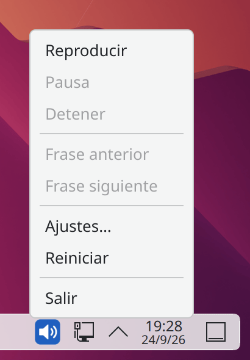
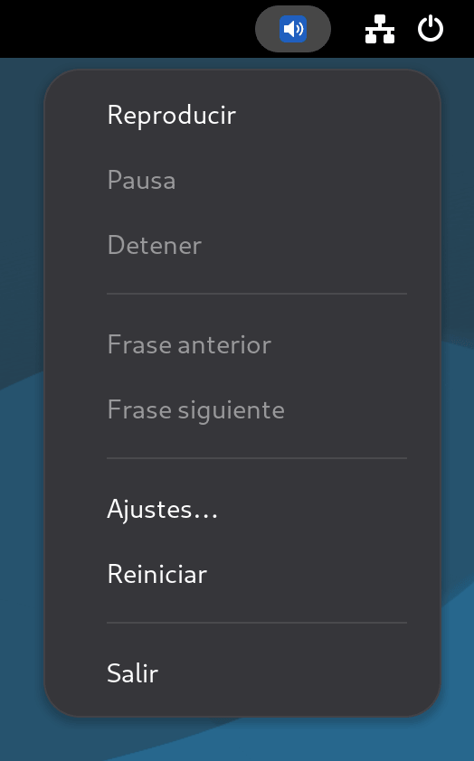
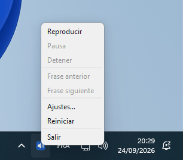

# PiperRead

<p align="center">
  
  
  
  
  
</p>

[English](../../README.md) | [Français](../fr-FR/README.md) | [Deutsch](../de-DE/README.md) | **Español**

## Descripción

**PiperRead** es una solución de automatización ligera diseñada para llevar la síntesis de voz neuronal (TTS) de alta calidad a los escritorios Linux.

**Sitio web oficial**: [piperread.davalan.fr](https://piperread.davalan.fr)

A diferencia de las soluciones en la nube, PiperRead funciona completamente sin conexión (local) gracias al motor [Piper](https://github.com/OHF-voice/piper1-gpl). Actúa como un puente entre su entorno de escritorio (portapapeles/ratón) y el motor de síntesis.

Permite leer en voz alta cualquier texto seleccionado con el ratón o copiado en el portapapeles, sin necesidad de un lector de pantalla complejo.

## Dos formas de leer

Ambas son independientes: ninguna controla a la otra, y cada una funciona sin la otra. La [instalación](#instalación-desde-un-paquete) empieza por la elección entre ellas.

*   **El lanzador** (`piperread`, o `read.sh` desde un clon): un botón o un atajo de teclado lee la selección. Nada se ejecuta entre dos lecturas; la voz se carga de nuevo en cada clic, por lo que el primer sonido llega unos 1,3 segundos después.
*   **La interfaz** (`piperread-gui`, un paquete aparte): un icono residente en la bandeja del sistema que se inicia con su sesión y mantiene la voz cargada. La lectura comienza en menos de 168 milisegundos tras el clic, y añade pausa, reanudación y navegación frase por frase. También funciona en Windows.

Si se inician juntas, ambas leen al mismo tiempo (dos voces superpuestas): elija un gesto.

La interfaz es un icono de la bandeja del sistema; un clic derecho sobre él abre su menú.

<p align="center">
  
  &nbsp;&nbsp;&nbsp;
  
  &nbsp;&nbsp;&nbsp;
  
</p>
<p align="center"><sub>KDE Plasma, GNOME (con la extensión AppIndicator) y Windows 11</sub></p>

## Casos de uso

*   **Accesibilidad**: lectura rápida de contenidos para personas con discapacidad visual leve o fatiga visual.
*   **Productividad**: escucha de artículos o documentos mientras se realiza otra tarea.
*   **Corrección**: relectura de textos propios mediante una voz externa para detectar errores.

## Funcionalidades clave

*   **Privacidad total**: procesamiento 100% local. No se envían datos a ninguna nube.
*   **Latencia cero**: sin ida y vuelta por la red, y medido: aproximadamente 1,3 segundos desde el lanzador hasta el primer sonido, 168 milisegundos desde un clic hasta el primer sonido con la interfaz residente (mediciones más abajo).
*   **Compatibilidad universal**: detecta y se adapta automáticamente a **Wayland** (Debian 12/13) o **X11**.
*   **Selección inteligente**: prioriza la selección del ratón (primaria) y cambia al portapapeles si no hay ninguna selección activa.
*   **Aislamiento**: se ejecuta en su propio entorno virtual de Python para no contaminar su sistema.

---

## Instalación desde un paquete

### ¿Quiere la interfaz?

**Terminal y botón.** Un atajo de teclado, el comando `piperread` o el botón Leer la selección del menú de aplicaciones lee la selección. Un paquete, unos 195 MB de descarga y 680 MB una vez instalado en Debian 13.

**Con la interfaz.** Lo mismo, más un icono de la bandeja que se inicia con su sesión, mantiene la voz cargada y añade pausa, reanudación y navegación frase por frase. Dos paquetes en un archivo «todo en uno», unos 460 MB de descarga y 1,4 GB una vez instalado en Debian 13, porque la interfaz usa Qt (PySide6), que las distribuciones no empaquetan.

Las cifras se midieron en un contenedor con Debian 13, dependencias incluidas (otras distribuciones: de 117 a 304 MB y de 329 a 792 MB para el terminal, de 421 a 483 MB y de 1,26 a 1,49 GB con la interfaz). Si no está seguro, tome terminal y botón: la interfaz se puede añadir más tarde con un solo comando. Siga una secuencia desde su primer paso hasta el último; el gestor de paquetes instala los [requisitos previos](#requisitos-previos).

### Terminal y botón

1.  Descargue el paquete de su sistema desde la [página de descargas](https://piperread.davalan.fr/es/download/) o desde la [última Release](https://github.com/RonanDavalan/PiperRead/releases/latest).
2.  Instálelo:

    ```bash
    # Debian 12 y 13, Ubuntu 22.04 y 24.04, Linux Mint
    sudo apt install ./piperread_0.4.0~beta_all.deb

    # Fedora 42
    sudo dnf install ./piperread-0.4.0~beta-1.fc42.noarch.rpm

    # openSUSE Leap 15.6
    sudo zypper install ./piperread-0.4.0~beta-1.leap156.noarch.rpm

    # Arch Linux
    sudo pacman -U ./piperread-0.4.0beta-1-any.pkg.tar.zst
    ```

    El paquete instala el motor Piper con `pip` al configurarse, y solo necesita acceso a la red en ese momento. No incluye ninguna voz.
3.  Añada una voz. La primera línea de `piperread --list-voices` es el comando exacto que instala la voz recomendada para su idioma; el segundo comando de abajo propone esa voz y pide confirmación.

    ```bash
    piperread --list-voices
    piperread --download-voice
    ```
4.  Seleccione un texto con el ratón y ejecute `piperread` (o pulse Leer la selección en su menú de aplicaciones). Compruebe la instalación con `piperread --diagnose`.

### Con la interfaz

1.  Descargue el archivo «todo en uno» de su familia de distribuciones (`debian`, `fedora`, `opensuse` o `arch`) desde la [página de descargas](https://piperread.davalan.fr/es/download/) o desde la [última Release](https://github.com/RonanDavalan/PiperRead/releases/latest). Contiene `piperread` y `piperread-gui`, y nada más.
2.  Extráigalo e instale los dos paquetes con un solo comando:

    ```bash
    # Debian 12 y 13, Ubuntu 22.04 y 24.04, Linux Mint
    tar -xzf piperread-all-in-one-0.4.0-beta-debian.tar.gz
    sudo apt install ./piperread_0.4.0~beta_all.deb ./piperread-gui_0.4.0~beta_all.deb

    # Fedora 42
    tar -xzf piperread-all-in-one-0.4.0-beta-fedora.tar.gz
    sudo dnf install ./piperread-0.4.0~beta-1.fc42.noarch.rpm ./piperread-gui-0.4.0~beta-1.fc42.noarch.rpm

    # openSUSE Leap 15.6
    tar -xzf piperread-all-in-one-0.4.0-beta-opensuse.tar.gz
    sudo zypper install ./piperread-0.4.0~beta-1.leap156.noarch.rpm ./piperread-gui-0.4.0~beta-1.leap156.noarch.rpm

    # Arch Linux
    tar -xzf piperread-all-in-one-0.4.0-beta-arch.tar.gz
    sudo pacman -U ./piperread-0.4.0beta-1-any.pkg.tar.zst ./piperread-gui-0.4.0beta-1-any.pkg.tar.zst
    ```

    La instalación descarga el motor y después Qt (unos 245 MB) en entornos virtuales privados, y solo necesita acceso a la red en ese momento. No se incluye ninguna voz.
3.  Inicie la interfaz: elija PiperRead en su menú de aplicaciones o ejecute `piperread-gui --play` (también arranca sola en su próxima sesión). Sin ninguna voz instalada, se abre una ventana llamada «Descargar una voz»: elija una voz y pulse Descargar. No se descarga nada antes de esa pulsación.
4.  Seleccione o copie un texto y pulse después el icono de la bandeja: lee cuando está detenido, hace una pausa mientras lee y reanuda cuando está en pausa.

Los paquetes se validaron en contenedores (instalación, actualización desde la versión anterior, diagnóstico y desinstalación) en cada distribución y versión indicadas arriba. El manual está disponible como página (`man piperread`) y como PDF en cuatro idiomas en la página de descargas.

### Con la interfaz en Windows

En Windows solo está disponible la interfaz, como una carpeta autónoma.

1.  Descargue `piperread-gui-windows.zip` desde la [última Release](https://github.com/RonanDavalan/PiperRead/releases/latest).
2.  Descomprímalo donde quiera, conservando la carpeta entera.
3.  Haga doble clic en `piperread-gui.exe`. Sin ninguna voz instalada, se abre la ventana «Descargar una voz»: elija una voz y pulse Descargar. (A mano: coloque dos archivos con el mismo nombre, `<nombre>.onnx` y `<nombre>.onnx.json`, procedentes de [rhasspy/piper-voices](https://huggingface.co/rhasspy/piper-voices), en la carpeta `voices`.)
4.  Copie un texto con Ctrl+C y pulse después el icono de la bandeja.

La compilación no está firmada con un certificado que Windows reconozca: SmartScreen puede avisar en el primer inicio (elija «Más información» y después «Ejecutar de todas formas»). Lee solo el portapapeles, no la selección del ratón. Se probó a mano en Windows 11; no hay ninguna matriz de pruebas automatizada para Windows como la hay para los paquetes de Linux.

## Requisitos previos

Antes de la instalación desde las fuentes, asegúrese de que su sistema dispone de las herramientas de audio y portapapeles necesarias.

```bash
# Actualización del sistema
sudo apt update

# Instalación de Python, audio y herramientas de portapapeles
# (Instala tanto wl-clipboard para Wayland como xsel para X11 para garantizar la compatibilidad)
sudo apt install -y python3 python3-venv python3-pip alsa-utils wl-clipboard xsel libnotify-bin
```

---

## Instalación desde las fuentes

Dado que este proyecto se basa en modelos vocales pesados y un entorno virtual específico, debe inicializar el proyecto después de clonarlo.

### 1. Clonar el repositorio

```bash
mkdir -p $HOME/git/piper
cd $HOME/git/piper
git clone https://github.com/RonanDavalan/PiperRead.git
cd PiperRead
```

### 2. Inicializar el entorno (crítico)

Este paso crea el aislamiento de Python, instala el motor y descarga la voz que usted elija. `./read.sh --list-voices` muestra las voces propuestas con su licencia, su tamaño y enlaces para escucharlas; la calidad de una voz queda a la apreciación de cada uno.

```bash
# Creación del entorno virtual
python3 -m venv piper-env

# Instalación del motor Piper TTS
./piper-env/bin/pip install piper-tts

# Descarga de una voz (opciones: ./read.sh --list-voices)
./read.sh --download-voice es_ES-davefx-medium
```

### 3. Configuración de permisos

```bash
chmod 700 read.sh
```

### 4. Integración en el escritorio (icono y menú)

Para lanzar PiperRead como una aplicación nativa:

```bash
# Creación de las carpetas de aplicaciones e iconos locales
mkdir -p $HOME/.local/share/applications $HOME/.local/share/icons/hicolor/scalable/apps

# Instalación del icono
cp Ressources/piperread.svg $HOME/.local/share/icons/hicolor/scalable/apps/

# Generación del archivo desktop con la ruta de instalación real
sed "s|\$HOME/git/piper/PiperRead|$(pwd)|g" Ressources/PiperRead.desktop > $HOME/.local/share/applications/piperread.desktop

# Actualización de la base de datos de menús
update-desktop-database $HOME/.local/share/applications
```

### 5. La interfaz

La interfaz de bandeja se encuentra en la carpeta `gui/` del repositorio y también se ejecuta desde un clon, con su propio entorno de Python: consulte [gui/README.md](gui/README.md). Una vez preparado ese entorno, inicie la interfaz con `gui/.venv/bin/python3 -m piperread_gui.app`; con el paquete `piperread-gui` instalado, el comando es `piperread-gui`.

---

## Uso

### Método 1: Selección con ratón (recomendado)

1.  **Resalte texto** en cualquier aplicación (navegador, PDF, editor).
2.  Haga clic en el icono **PiperRead** en su menú (o use su atajo de teclado personalizado).
3.  El texto se lee inmediatamente.

### Método 2: Portapapeles

1.  Copie texto (**Ctrl+C**).
2.  Lance PiperRead.

### Detener la lectura

Ejecute `piperread --stop` (o `./read.sh --stop` desde un clon) para terminar la lectura, `--pause` para suspenderla y `--resume` para reanudarla donde se detuvo. Asigne estos comandos a atajos de teclado si lo desea.

### La interfaz residente

El paquete `piperread-gui` se inicia con su sesión (un escritorio Linux lee su entrada de inicio automático; en Windows, PiperRead se añade a los programas de inicio en el primer inicio). Aparece un icono en la bandeja; la voz se carga en segundo plano y permanece cargada, y mientras se reproduce una frase la siguiente ya se está sintetizando.

*   **Clic izquierdo** en el icono: leer cuando está detenido, pausar durante la lectura, reanudar cuando está en pausa.
*   **Clic derecho**: el menú (Reproducir, Pausa, Detener, Frase anterior, Frase siguiente, Ajustes, Reiniciar, Salir), en el idioma de su configuración.
*   **Lo que se lee**: la selección del ratón, o el portapapeles cuando no hay nada seleccionado (Linux, el mismo orden que el lanzador); solo el portapapeles en Windows. El marcado Markdown se elimina primero.
*   **Ajustes**: la entrada del menú abre un diálogo para la voz, la velocidad, el idioma y "Iniciar con la sesión" (activado por defecto; desmárquelo para detener el inicio automático), y un botón «Descargar una voz…» que abre la ventana de voces. Escribe el mismo `piperread.conf` que el lanzador.

La interfaz también se controla desde la línea de comandos, que es como se asigna a los atajos de teclado:

```bash
piperread-gui --play      # lee; inicia antes la interfaz si no está en ejecución
piperread-gui --pause
piperread-gui --resume
piperread-gui --stop
piperread-gui --next
piperread-gui --previous
piperread-gui --quit
```

Excepto `--play`, estos comandos devuelven un error cuando no hay ninguna interfaz en ejecución. En los escritorios que muestran una bandeja de forma nativa (KDE Plasma, XFCE, Cinnamon, MATE, LXQt) el icono simplemente aparece. GNOME no muestra bandeja por defecto: PiperRead lo indica una vez en una notificación y sigue siendo totalmente utilizable mediante los comandos anteriores; para obtener el icono, instale la extensión "AppIndicator and KStatusNotifierItem Support".

### Latencia medida

"Latencia cero" significa que no hay ningún viaje de ida y vuelta por la red entre la selección y el primer sonido: todo se ejecuta en su equipo. La duración en sí se midió el 23 de septiembre de 2026, en el equipo del mantenedor (32 núcleos) con la voz `fr_FR-siwis-medium`. Varía según el equipo y la voz; tómelo como un orden de magnitud, no como una garantía.

| Ruta | Medición |
|---|---|
| Lanzador (`read.sh auto`), voz cargada en cada clic | 1,31 a 1,34 s desde el lanzamiento hasta el primer byte de audio |
| Interfaz, voz ya cargada | 168 ms desde el clic hasta la apertura del flujo de audio |

En reposo la interfaz no usa CPU; su memoria es de unos 100 MB, más 150 MB (voz cargada) a 370 MB (después del uso) para el servidor de síntesis que inicia, que escucha solo en `127.0.0.1`.

### Configuración

Se pueden ajustar cuatro parámetros: la velocidad de lectura `speed` (un multiplicador de 0,5 a 3,0; 1 es la voz natural), la voz `voice` (el nombre del modelo, tal como aparece con `--list-voices`), el idioma `lang` de los mensajes (`en`, `fr`, `de` o `es`) y `telemetry` (`on` o `off`, véase más abajo). Cada uno se resuelve en este orden — el primer nivel que aporte un valor válido prevalece:

1.  **Opción en la línea de comandos** — `--speed 1.25`, `--voice en_US-ljspeech-medium`, `--lang en` (`telemetry` no tiene opción).
2.  **Variable de entorno** — `PIPERREAD_SPEED`, `PIPERREAD_VOICE`, `PIPERREAD_LANG`, `PIPERREAD_TELEMETRY`.
3.  **Archivo de configuración** — `~/.config/piperread/piperread.conf` (en Windows, `%USERPROFILE%\.config\piperread\piperread.conf`), una línea `key=value` por parámetro:
    ```
    speed=1.25
    voice=en_US-ljspeech-medium
    lang=en
    telemetry=off
    ```
4.  **Predeterminado** — velocidad natural, primera voz instalada por orden alfabético, mensajes en inglés, telemetría desactivada.

Un valor inválido en cualquier nivel distinto de la opción se ignora y se intenta el siguiente nivel; una opción de línea de comandos inválida detiene la lectura.

### Telemetría del motor

La biblioteca de inferencia que Piper incorpora (`onnxruntime`) envía eventos de uso a Microsoft por defecto. PiperRead los desactiva antes de iniciar el motor, para que la lectura permanezca sin conexión: `strace` no muestra ninguna conexión externa durante la lectura, ni con el lanzador ni con la interfaz. En Windows, la biblioteca escribe sus eventos en el sistema, que puede reenviarlos según sus ajustes de privacidad; PiperRead invoca el propio interruptor de la biblioteca, y una medición mostró que quedaban 4 eventos de inicialización frente a 15 sin él. `telemetry=on` (o `PIPERREAD_TELEMETRY=on`) los vuelve a activar.

---

## Calidad

Este proyecto nació de un descubrimiento: la calidad impresionante del motor **Piper** para una solución totalmente libre y local.

*   **Renderizado de voz natural**: la elección de esta tecnología neuronal permite una lectura fluida y pausada, haciendo la escucha cómoda a largo plazo.
*   **Arquitectura ligera**: PiperRead no es una aplicación pesada, sino un orquestador minimalista. Conecta su escritorio y el motor de audio con una huella de sistema casi nula.
*   **Instalación limpia**: el uso estricto de entornos virtuales (venv) garantiza que el software permanezca confinado y no modifique las bibliotecas de su sistema principal.

---

## Origen del proyecto

El impulso de este proyecto proviene de mi hermano, usuario histórico de Debian, quien identificó a Piper como la solución útil para TTS local.

---

## Créditos y "Vibe Coding"

El proyecto **PiperRead** es el resultado de una colaboración híbrida **Humano-IA**:

*   **Ronan Davalan**: arquitecto y árbitro. Visión de producto, requisitos de seguridad, dirección del proyecto, validación y pruebas. Todas las decisiones de arquitectura son validadas por él.
*   **Claude Code (Anthropic)**: ingeniero de sistemas y desarrollador principal. Implementación de los scripts Bash, de la documentación y del sitio web; decisiones técnicas dentro de la arquitectura validada. Autor principal del código fuente.
*   **Google Gemini**: sintetizador y asesor estratégico. Análisis de arquitectura independiente, resolución de conflictos lógicos, optimización del flujo de trabajo, validación cruzada de decisiones técnicas.
*   **Muse Spark**: sintetizador y asesor estratégico. Sustituye a Gemini en algunas sesiones, con buenos resultados; algunas de sus respuestas se transmitieron a Claude Code.
*   **DeepSeek**: limpieza del marco de trabajo del proyecto, al inicio.
*   **Motor Core**: [Piper TTS](https://github.com/OHF-voice/piper1-gpl), con licencia GPL-3.0-or-later. Se instala en su equipo mediante `pip` y se invoca como programa externo; PiperRead no lo redistribuye.
