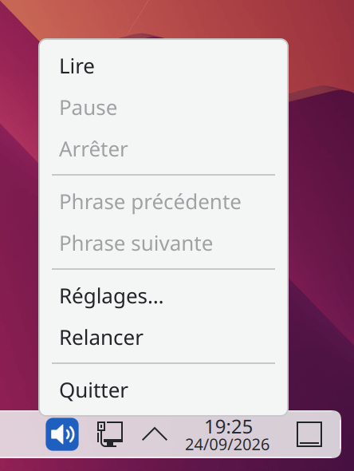
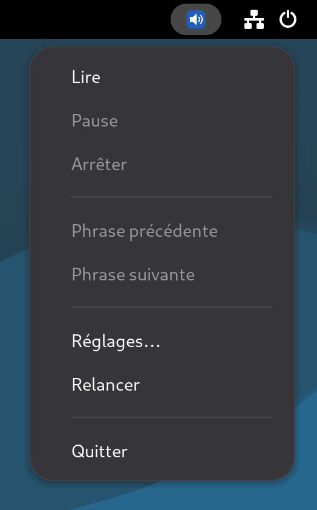
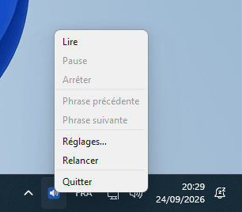

# PiperRead

<p align="center">
  
  
  
  
  
</p>

[English](../../README.md) | **Français** | [Deutsch](../de-DE/README.md) | [Español](../es-ES/README.md)

## Description

**PiperRead** est une solution d'automatisation légère conçue pour apporter une synthèse vocale neuronale (TTS) de haute qualité sur les bureaux Linux.

**Site officiel** : [piperread.davalan.fr](https://piperread.davalan.fr)

Contrairement aux solutions cloud, PiperRead fonctionne entièrement hors-ligne (local) grâce au moteur [Piper](https://github.com/OHF-voice/piper1-gpl). Il fait le pont entre votre environnement de bureau (presse-papiers/souris) et le moteur de synthèse.

Il permet de lire à haute voix n'importe quel texte sélectionné à la souris ou copié dans le presse-papiers, sans nécessiter de lecteur d'écran complexe.

## Deux façons de lire

Les deux sont indépendants : aucun ne pilote l'autre, et chacun fonctionne sans l'autre.

*   **Le lanceur** (`piperread`, ou `read.sh` depuis un clone) : un bouton ou un raccourci clavier lit la sélection. Rien ne s'exécute entre deux lectures ; la voix est chargée à nouveau à chaque clic, donc le premier son arrive environ 1,3 seconde plus tard.
*   **L'interface** (`piperread-gui`, en option) : une icône résidente dans la barre d'état qui démarre avec votre session et garde la voix chargée. La lecture démarre en moins de 168 millisecondes après le clic, et elle ajoute la pause, la reprise et la navigation phrase par phrase. Elle fonctionne aussi sur Windows.

Lancés ensemble, les deux lisent en même temps (deux voix superposées) : choisissez un seul geste.

L'interface est une icône de la barre d'état ; un clic droit dessus ouvre son menu.

<p align="center">
  
  &nbsp;&nbsp;&nbsp;
  
  &nbsp;&nbsp;&nbsp;
  
</p>
<p align="center"><sub>KDE Plasma, GNOME (avec l'extension AppIndicator) et Windows 11</sub></p>

## Cas d'usage

*   **Accessibilité** : lecture rapide de contenus pour les personnes ayant une déficience visuelle légère ou une fatigue oculaire.
*   **Productivité** : écoute d'articles ou de documents pendant l'exécution d'une autre tâche.
*   **Correction** : relecture de ses propres textes par une voix tierce pour détecter les erreurs.

## Fonctionnalités clés

*   **Confidentialité totale** : traitement 100% local. Aucune donnée n'est envoyée vers un cloud.
*   **Latence nulle** : pas d’aller-retour réseau, et mesuré : environ 1,3 seconde du lanceur au premier son, 168 millisecondes d’un clic au premier son avec l’interface résidente (mesures ci-dessous).
*   **Compatibilité universelle** : détecte et s'adapte automatiquement à **Wayland** (Debian 12/13) ou **X11**.
*   **Sélection intelligente** : priorise la sélection souris (primaire) et bascule sur le presse-papiers si aucune sélection n'est active.
*   **Isolation** : s'exécute dans son propre environnement virtuel Python pour ne pas polluer votre système.

---

## Installation par paquet

La voie la plus simple. Téléchargez le paquet de votre système depuis la [page de téléchargement](https://piperread.davalan.fr/fr/download/) ou depuis la [dernière Release](https://github.com/RonanDavalan/PiperRead/releases/latest), puis installez-le :

```bash
# Debian 12 et 13, Ubuntu 22.04 et 24.04, Linux Mint
sudo apt install ./piperread_0.3.3~beta_all.deb

# Fedora 42
sudo dnf install ./piperread-0.3.3~beta-1.fc42.noarch.rpm

# openSUSE Leap 15.6
sudo zypper install ./piperread-0.3.3~beta-1.leap156.noarch.rpm

# Arch Linux
sudo pacman -U piperread-0.3.3beta-1-any.pkg.tar.zst
```

Le paquet installe le moteur Piper avec `pip` à sa configuration : environ 75 Mo à télécharger (200 à 250 Mo une fois installé), avec un accès réseau à ce seul moment. Il ne contient aucune voix. Téléchargez-en une, puis vérifiez l'installation :

```bash
piperread --download-voice
piperread --diagnose
```

Les paquets ont été validés en conteneur (installation, diagnostic et retrait) sur chaque distribution et chaque version listées ci-dessus. Le manuel existe sous forme de page (`man piperread`) et de PDF en quatre langues sur la page de téléchargement.

### L'interface (facultative)

`piperread-gui` est un paquet séparé qui dépend de `piperread` : installez d'abord le cœur (ou les deux en une seule commande, par exemple `sudo apt install ./piperread_0.3.3~beta_all.deb ./piperread-gui_0.3.3~beta_all.deb`).

```bash
# Debian 12 et 13, Ubuntu 22.04 et 24.04, Linux Mint
sudo apt install ./piperread-gui_0.3.3~beta_all.deb

# Fedora 42
sudo dnf install ./piperread-gui-0.3.3~beta-1.fc42.noarch.rpm

# openSUSE Leap 15.6
sudo zypper install ./piperread-gui-0.3.3~beta-1.leap156.noarch.rpm

# Arch Linux
sudo pacman -U piperread-gui-0.3.3beta-1-any.pkg.tar.zst
```

L'interface utilise Qt (PySide6), que les distributions ne fournissent pas : l'installation le récupère avec `pip` dans un environnement virtuel privé, environ 245 Mo à télécharger (650 à 700 Mo une fois installé), avec un accès réseau à ce seul moment. Les mêmes paquets ont été validés en conteneur sur les mêmes distributions.

### Windows (interface uniquement)

Le lanceur est un outil Linux ; sous Windows, seule l'interface est disponible, sous forme de dossier autonome. Téléchargez `piperread-gui-windows.zip` depuis la [dernière Release](https://github.com/RonanDavalan/PiperRead/releases/latest) et décompressez-le où vous voulez, en conservant le dossier intact. Placez une voix dans son dossier `voices` (deux fichiers portant le même nom, `<name>.onnx` et `<name>.onnx.json`, depuis [rhasspy/piper-voices](https://huggingface.co/rhasspy/piper-voices)), puis double-cliquez sur `piperread-gui.exe`. Cette version n'est pas signée avec un certificat reconnu par Windows : SmartScreen peut afficher un avertissement au premier lancement (choisissez "More info", puis "Run anyway"). Elle lit uniquement le presse-papiers, pas la sélection de la souris. Elle a été essayée manuellement sous Windows 11 ; il n'existe pas de matrice de tests automatisés pour Windows comme pour les paquets Linux.

## Prérequis

Avant l'installation depuis les sources, assurez-vous que votre système dispose des outils audio et presse-papiers nécessaires.

```bash
# Mise à jour du système
sudo apt update

# Installation de Python, audio et outils presse-papiers
# (Installe à la fois wl-clipboard pour Wayland et xsel pour X11 pour garantir la compatibilité)
sudo apt install -y python3 python3-venv python3-pip alsa-utils wl-clipboard xsel libnotify-bin
```

---

## Installation depuis les sources

Puisque ce projet repose sur des modèles vocaux lourds et un environnement virtuel spécifique, vous devez initialiser le projet après l'avoir cloné.

### 1. Cloner le dépôt

```bash
mkdir -p $HOME/git/piper
cd $HOME/git/piper
git clone https://github.com/RonanDavalan/PiperRead.git
cd PiperRead
```

### 2. Initialiser l'environnement (critique)

Cette étape crée l'isolation Python, installe le moteur, puis télécharge la voix que vous choisissez. `./read.sh --list-voices` liste les voix proposées avec leur licence, leur taille et des liens d'écoute ; la qualité d'une voix reste à l'appréciation de chacun.

```bash
# Création de l'environnement virtuel
python3 -m venv piper-env

# Installation du moteur Piper TTS
./piper-env/bin/pip install piper-tts

# Téléchargement d'une voix (choix : ./read.sh --list-voices)
./read.sh --download-voice fr_FR-siwis-medium
```

### 3. Configuration des permissions

```bash
chmod 700 read.sh
```

### 4. Intégration au bureau (icône et menu)

Pour lancer PiperRead comme une application native :

```bash
# Création des dossiers d'applications et d'icônes locales
mkdir -p $HOME/.local/share/applications $HOME/.local/share/icons/hicolor/scalable/apps

# Installation de l'icône
cp Ressources/piperread.svg $HOME/.local/share/icons/hicolor/scalable/apps/

# Génération du fichier desktop avec le chemin d'installation réel
sed "s|\$HOME/git/piper/PiperRead|$(pwd)|g" Ressources/PiperRead.desktop > $HOME/.local/share/applications/piperread.desktop

# Mise à jour de la base de données des menus
update-desktop-database $HOME/.local/share/applications
```

### 5. L’interface (facultative)

L’interface de la zone de notification se trouve dans le dossier `gui/` du dépôt et fonctionne aussi depuis un clone, avec son propre environnement Python : voir [gui/README.md](gui/README.md). Une fois cet environnement en place, lancez l’interface avec `gui/.venv/bin/python3 -m piperread_gui.app` ; avec le paquet `piperread-gui` installé, la commande est `piperread-gui`.

---

## Utilisation

### Méthode 1 : Sélection souris (recommandé)

1.  **Surlignez du texte** dans n'importe quelle application (navigateur, PDF, éditeur).
2.  Cliquez sur l'icône **PiperRead** dans votre menu (ou utilisez votre raccourci clavier personnalisé).
3.  Le texte est lu immédiatement.

### Méthode 2 : Presse-papiers

1.  Copiez du texte (**Ctrl+C**).
2.  Lancez PiperRead.

### Arrêter la lecture

Lancez `piperread --stop` (ou `./read.sh --stop` depuis un clone) pour terminer la lecture, `--pause` pour la suspendre et `--resume` pour la reprendre là où elle s'est arrêtée. Liez ces commandes à des raccourcis clavier si vous le souhaitez.

### L'interface résidente

Le paquet `piperread-gui` démarre avec votre session (un bureau Linux lit son entrée de démarrage automatique ; sur Windows, PiperRead s'ajoute aux programmes de démarrage au premier lancement). Une icône de la zone de notification apparaît ; la voix se charge en arrière-plan et reste chargée, et pendant qu'une phrase est lue la suivante est déjà en cours de synthèse.

*   **Clic gauche** sur l'icône : lire à l'arrêt, mettre en pause pendant la lecture, reprendre en pause.
*   **Clic droit** : le menu (Lire, Pause, Arrêter, Phrase précédente, Phrase suivante, Réglages, Relancer, Quitter), dans la langue de votre configuration.
*   **Ce qui est lu** : la sélection de la souris, ou le presse-papiers quand rien n'est sélectionné (sur Linux, le même ordre que le lanceur) ; le presse-papiers uniquement sur Windows. Le balisage Markdown est d'abord supprimé.
*   **Réglages** : l'entrée de menu ouvre une boîte de dialogue pour la voix, la vitesse, la langue et « Lancer à l'ouverture de session » (activé par défaut ; décochez-le pour arrêter le démarrage automatique). Elle écrit le même `piperread.conf` que le lanceur.

L'interface se pilote aussi depuis la ligne de commande, ce qui vous permet de l'associer à des raccourcis clavier :

```bash
piperread-gui --play      # lit ; lance d'abord l'interface si elle ne tourne pas
piperread-gui --pause
piperread-gui --resume
piperread-gui --stop
piperread-gui --next
piperread-gui --previous
piperread-gui --quit
```

À l'exception de `--play`, ces commandes signalent une erreur quand aucune interface n'est en cours d'exécution. Sur les bureaux qui affichent nativement une zone de notification (KDE Plasma, XFCE, Cinnamon, MATE, LXQt), l'icône apparaît simplement. GNOME n'affiche aucune zone de notification par défaut : PiperRead le signale une fois dans une notification et reste entièrement utilisable grâce aux commandes ci-dessus ; pour obtenir l'icône, installez l'extension « AppIndicator and KStatusNotifierItem Support ».

### Latence mesurée

« Zero latency » signifie qu'il n'y a aucun aller-retour réseau entre la sélection et le premier son : tout s'exécute sur votre machine. La durée elle-même a été mesurée le 23 septembre 2026, sur la machine du mainteneur (32 cœurs) avec la voix `fr_FR-siwis-medium`. Elle varie selon la machine et la voix ; considérez-la comme un ordre de grandeur, pas comme une garantie.

| Chemin | Mesure |
|---|---|
| Lanceur (`read.sh auto`), voix chargée à chaque clic | 1,31 à 1,34 s du lancement au premier octet audio |
| Interface, voix déjà chargée | 168 ms du clic à l'ouverture du flux audio |

Au repos, l'interface n'utilise aucun processeur ; sa mémoire est d'environ 100 Mo, plus 150 Mo (voix chargée) à 370 Mo (après utilisation) pour le serveur de synthèse qu'elle démarre, qui n'écoute que sur `127.0.0.1`.

### Configuration

Quatre réglages sont ajustables : la vitesse de lecture `speed` (un multiplicateur de 0,5 à 3,0, 1 est la voix naturelle), la voix `voice` (le nom du modèle, tel que listé par `--list-voices`), la langue `lang` des messages (`en`, `fr`, `de` ou `es`) et `telemetry` (`on` ou `off`, voir ci-dessous). Chacun est résolu dans cet ordre — le premier niveau qui fournit une valeur valide l'emporte :

1.  **Option en ligne de commande** — `--speed 1.25`, `--voice en_US-ljspeech-medium`, `--lang en` (`telemetry` n'a pas d'option).
2.  **Variable d'environnement** — `PIPERREAD_SPEED`, `PIPERREAD_VOICE`, `PIPERREAD_LANG`, `PIPERREAD_TELEMETRY`.
3.  **Fichier de configuration** — `~/.config/piperread/piperread.conf` (sur Windows, `%USERPROFILE%\.config\piperread\piperread.conf`), une ligne `key=value` par réglage :
    ```
    speed=1.25
    voice=en_US-ljspeech-medium
    lang=en
    telemetry=off
    ```
4.  **Valeur par défaut** — vitesse naturelle, première voix installée par ordre alphabétique, messages en anglais, télémétrie désactivée.

Une valeur invalide à un niveau inférieur à l'option est ignorée et le niveau suivant est essayé ; une option en ligne de commande invalide arrête la lecture.

### Télémétrie du moteur

La bibliothèque d'inférence que Piper utilise (`onnxruntime`) envoie par défaut des événements d'utilisation à Microsoft. PiperRead les désactive avant de démarrer le moteur, pour que la lecture reste hors ligne : `strace` ne montre aucune connexion externe pendant la lecture, avec le lanceur comme avec l'interface. Sur Windows, la bibliothèque écrit ses événements dans le système, qui peut les transmettre selon vos paramètres de confidentialité ; PiperRead appelle le commutateur propre de la bibliothèque, et une mesure a montré 4 événements d'initialisation restants contre 15 sans lui. `telemetry=on` (ou `PIPERREAD_TELEMETRY=on`) les réactive.

---

## Qualité

Ce projet est né d'une découverte : la qualité impressionnante du moteur **Piper** pour une solution entièrement libre et locale.

*   **Rendu vocal naturel** : le choix de cette technologie neuronale permet une lecture fluide et posée, rendant l'écoute confortable sur la durée.
*   **Architecture légère** : PiperRead n'est pas une application lourde, mais un orchestrateur minimaliste. Il fait le lien entre votre bureau et le moteur audio avec une empreinte système quasi-nulle.
*   **Installation propre** : l'utilisation stricte d'environnements virtuels (venv) garantit que le logiciel reste confiné et ne modifie pas les bibliothèques de votre système principal.

---

## Origine du projet

L'impulsion de ce projet vient de mon frère, utilisateur historique de Debian, qui a identifié Piper comme la solution utile pour du TTS local.

---

## Crédits & "Vibe Coding"

Le projet **PiperRead** est le résultat d'une collaboration hybride **Humain-IA** :

*   **Ronan Davalan** : architecte et arbitre. Vision produit, exigences de sécurité, direction du projet, validation et tests. Toutes les décisions d'architecture sont validées par lui.
*   **Claude Code (Anthropic)** : ingénieur systèmes et développeur principal. Implémentation des scripts Bash, de la documentation et du site ; choix techniques dans l'architecture validée. Auteur principal du code source.
*   **Google Gemini** : synthétiseur et conseiller stratégique. Analyse d'architecture indépendante, résolution de conflits logiques, optimisation du flux de travail, validation croisée des décisions techniques.
*   **Muse Spark** : synthétiseur et conseiller stratégique. Remplace Gemini lors de certaines sessions, avec de bons résultats ; certaines de ses réponses ont été transmises à Claude Code.
*   **DeepSeek** : nettoyage du cadre de travail du projet, au départ.
*   **Moteur Core** : [Piper TTS](https://github.com/OHF-voice/piper1-gpl), sous licence GPL-3.0-or-later. Il est installé sur votre machine par `pip` et appelé comme programme externe ; PiperRead ne le redistribue pas.
